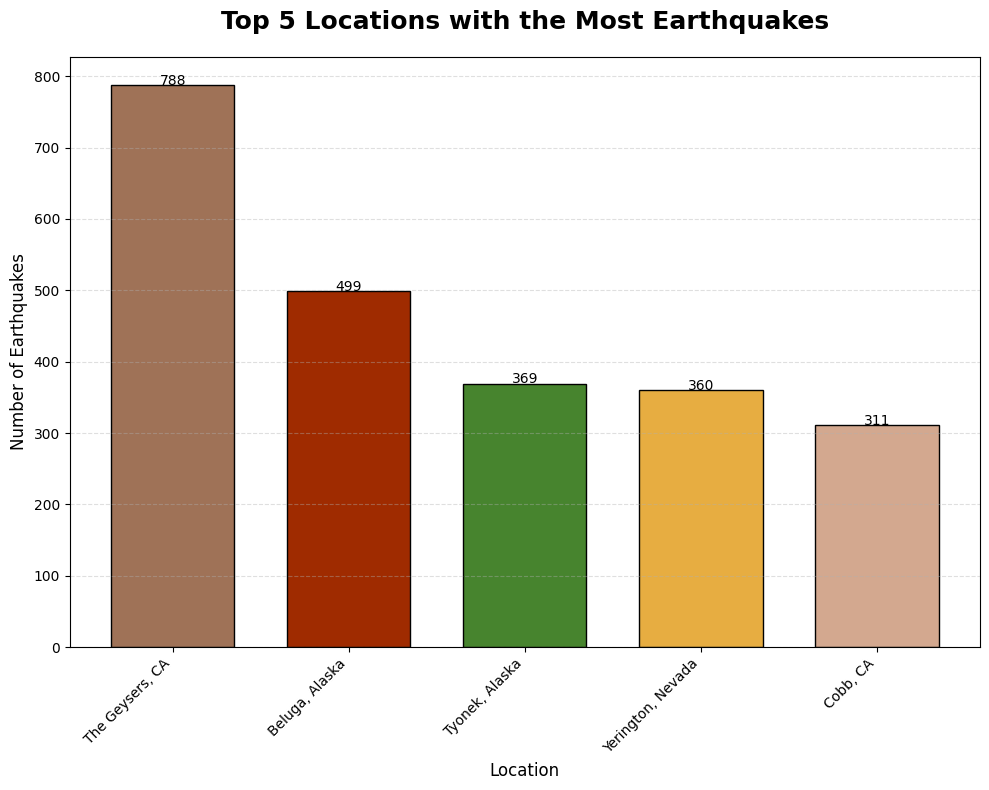
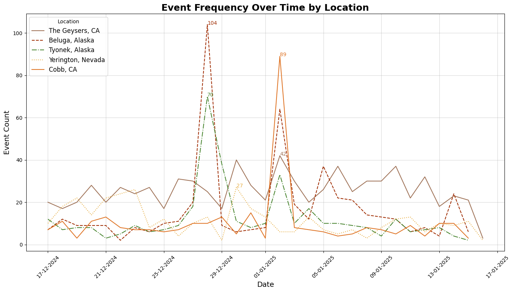

# Earthquake Event Analysis

This repository contains an analysis of earthquake events using Python. The project focuses on identifying trends, highlighting the most active locations, and visualizing the proportional contributions of events from key locations.

---

## Project Overview

The primary goals of this project are:
1. To identify the top 5 locations with the most recorded events.
2. To visualize the proportional contribution of these locations to the overall earthquake activity.
3. To analyze the frequency of earthquake events over time.

---

## Key Features

- **Data Visualization**: 
  - A bar chart identifying the top 5 most active earthquake locations.
    
  - A pie chart highlighting the proportional distribution of earthquake events.
    
  - A line chart showing event frequency trends over time for the top 5 locations.
    

  
- **Python Tools Used**:
  - `pandas` for data manipulation.
  - `matplotlib` for data visualization.
  - Jupyter Notebook for interactive data analysis.

---

## Files in the Repository

1. **`earthquake.ipynb`**: The main Jupyter Notebook containing the analysis and visualizations.
2. **Presentation**: A Google Slides presentation summarizing the project findings.
   - Link: [Earthquake Event Analysis Presentation](https://docs.google.com/presentation/d/1OAthb1z_73SAZfWrFCcbcj6tFst4ub88eZcWa4_lgn4/edit?usp=sharing)
3. **Images**: Exported visualizations for use in the presentation and README.

---

## How to Use

1. Clone the repository:
   ```bash
   git clone https://github.com/bytesbyt/earthquake.git
2. Install the required libraries:
    pip install -r requirements.txt
3. Open the Jupyter Notebook:
    jupyter notebook earthquake.ipynb
